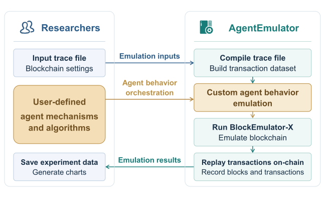
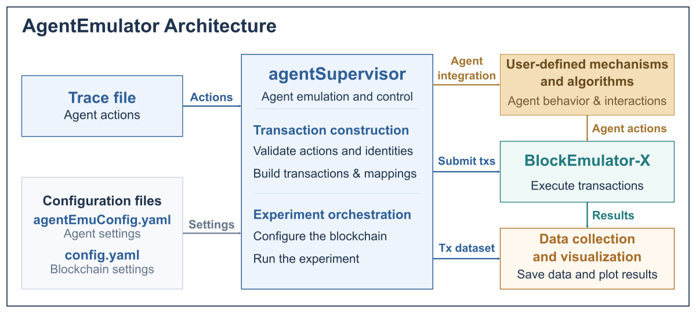
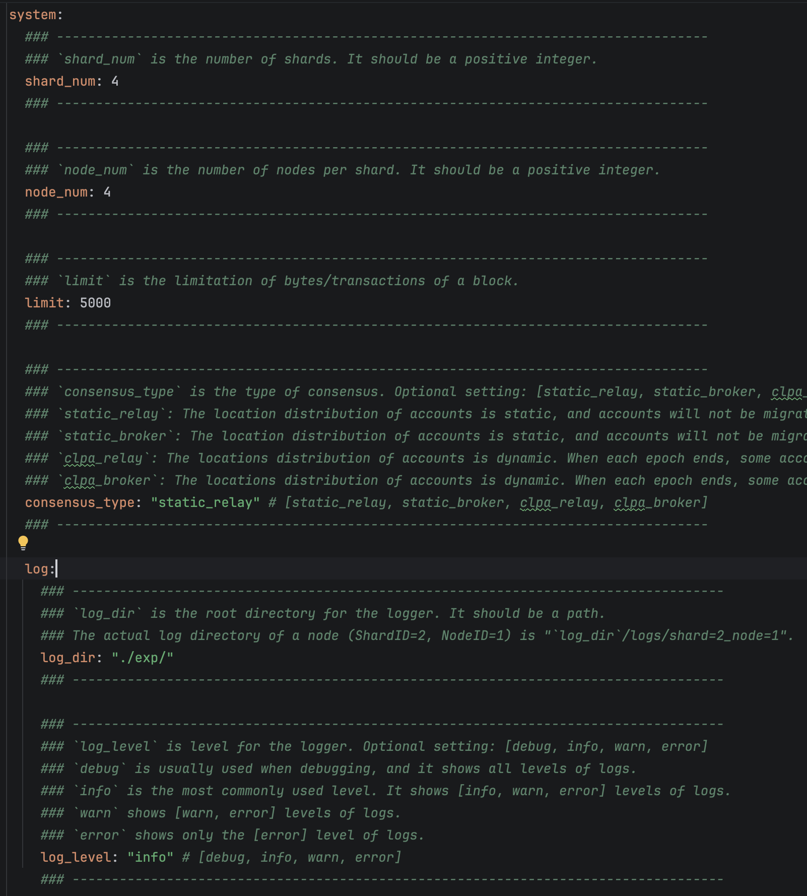
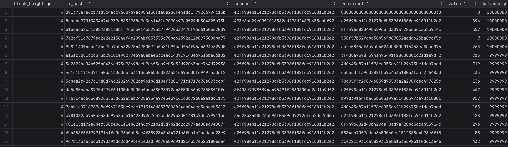
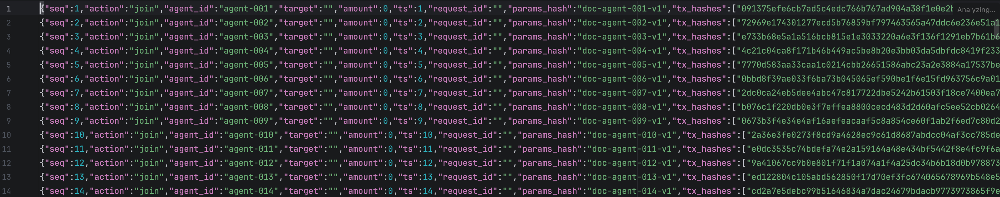
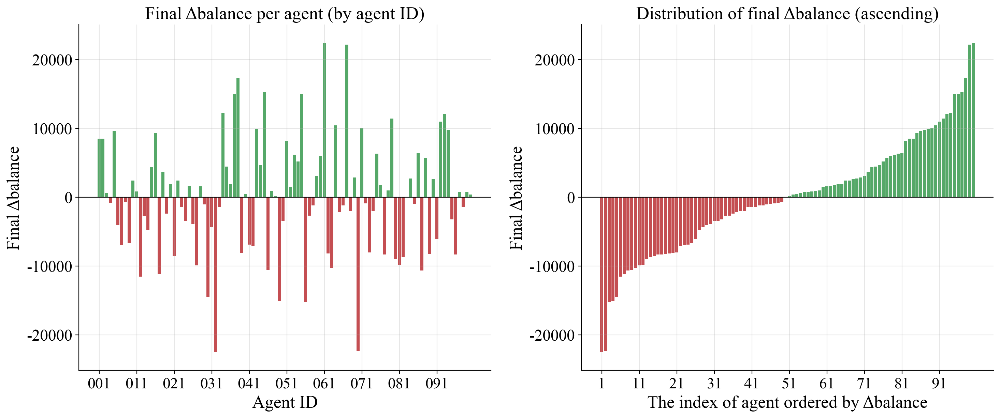
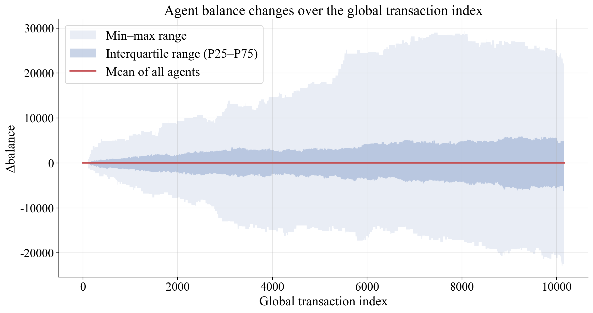
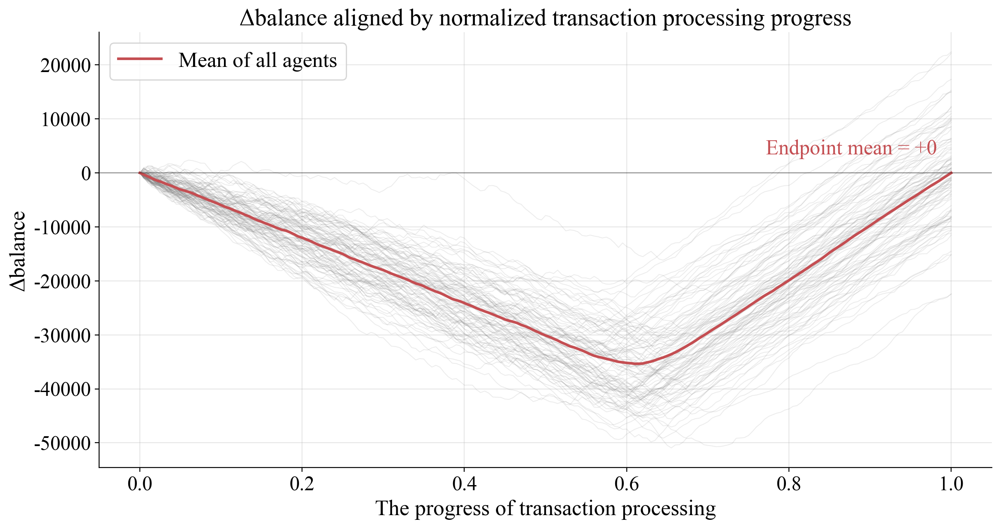
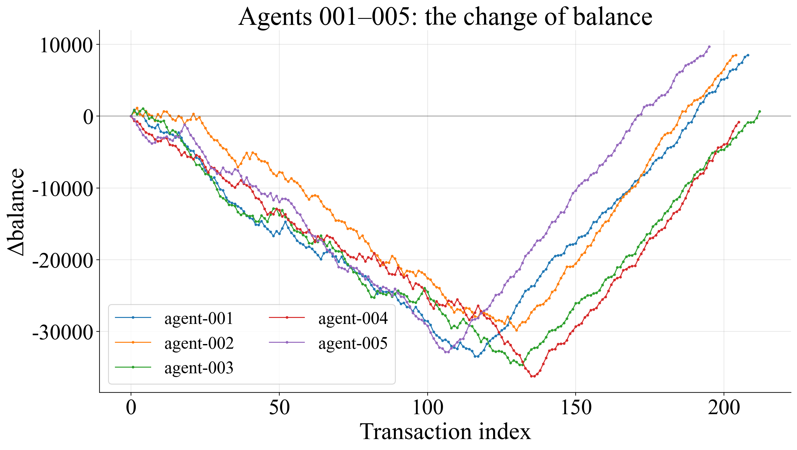
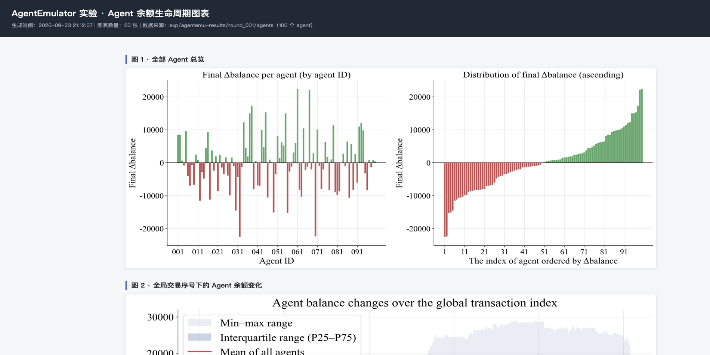

# AgentEmulator (v1.0) User Guide

For the Chinese version of this guide, see [README_zh.md](README_zh.md).

## Overview

### What is AgentEmulator?

AgentEmulator is an **emulation and experimentation platform for trustworthy AI agent infrastructure**. The platform was initiated by **[HuangLab](http://www.xintelligence.pro/)**, led by Professor Huawei Huang at the School of Software Engineering, Sun Yat-sen University. AgentEmulator uses blockchain as the foundation for trusted records and settlement. Researchers and students can investigate agent identity, behavioral auditing, payment settlement, incentives, and governance. AgentEmulator aims to support research into trustworthy interaction and collaboration among AI agents.

AgentEmulator is built on **[BlockEmulator-X](https://github.com/HuangLab-SYSU/block-emulator-x)**, HuangLab's blockchain emulation platform. HuangLab released BlockEmulator-X as open source in June 2026 as the successor to the original BlockEmulator. AgentEmulator extends BlockEmulator-X to experiments that combine AI agent behavior with blockchain execution.

### What does AgentEmulator support?

AgentEmulator is designed to simplify experiment setup, mechanism validation, and data analysis. Researchers can configure the underlying blockchain, observe agent behavior, and evaluate how different mechanisms affect experimental outcomes.



**Figure 1. AgentEmulator's general workflow.** This diagram illustrates the platform's broader purpose, beyond the current v1.0 release. The user-defined mechanisms and algorithms provide scope for extensions and original research.

### Roadmap

Development will focus on five areas: **identity, settlement, auditing, incentives, and governance**. The roadmap below is provisional and may evolve with research and development progress.

| Stage | Focus |
| --- | --- |
| **v1.0: Basic behavior emulation (current release)** | Trace-driven replay of `join`, `pay`, and `leave` actions, with transaction execution, action-to-transaction mapping, account records, and visualization. |
| **Near term: Identity and auditing** | Smart contract state management for DID registration and revocation, permission declarations, verifiable behavior logs, and traceability. |
| **Medium term: Payments and interactions** | Micropayments, payment channels, batch settlement, experiments with feedback across multiple rounds, and richer agent service interactions. |
| **Later: Incentives and collaborative governance** | Task allocation, behavior coordination, and accountability in multi-agent collaboration, with emulation and evaluation of different collaboration strategies. |
| **Long term: Benchmarking** | Standardized scenarios, datasets, and metrics for comparing trustworthy infrastructure approaches through reproducible experiments. |

### Current release: v1.0

**AgentEmulator v1.0 supports trace-driven behavior replay, records of identity registration and revocation, direct payments, experimental data collection, and visualization.** Researchers describe agent actions in a JSONL trace file. The `agentSupervisor` module compiles the trace into a transaction dataset. The module then starts a BlockEmulator-X blockchain and submits the transactions for on-chain execution and recording. After the experiment, AgentEmulator records transaction and account data and generates balance plots. AgentEmulator also creates an HTML gallery with Chinese and English interface options. The launch script opens the gallery in the default browser.

In v1.0, agent behavior is predefined in the trace. Transactions follow the **User-specified Original Sequence** policy. No additional transaction orchestration or scheduling algorithm is included. Researchers can extend the default policy with mechanisms such as transaction reordering, priority rules, or agent weights.

Future releases will expand the supported protocols, scenarios, and evaluation capabilities. Contributions and research-specific extensions are welcome.

### Repository

The source code is available on [GitHub](https://github.com/HuangLab-SYSU/agent-emulator).

### Terminology

The core workflow is: **describe agent behavior in a trace → compile the trace into transactions with `agentSupervisor` → execute the transactions in BlockEmulator-X → collect and visualize the results**.

| Term | Description |
| --- | --- |
| AgentEmulator | An agent behavior emulator built on BlockEmulator-X. AgentEmulator converts agent actions into blockchain transactions, records experimental data, and presents the results. |
| Agent | An experimental participant whose `join`, `pay`, and `leave` actions are defined in a trace. |
| BlockEmulator-X | The underlying blockchain emulator, responsible for node operation, consensus, block production, transaction execution, and on-chain records. See the [BlockEmulator-X repository](https://github.com/HuangLab-SYSU/block-emulator-x). |
| Trace file | A JSONL input file describing a sequence of agent actions. Each line contains one action or one plain transfer. |
| `agentEmuConfig.yaml` | The agent-level experiment configuration: trace path, identity derivation seed, output directory, and blockchain execution settings. |
| `config.yaml` | The BlockEmulator-X configuration template: shard count, node count, block interval, and other blockchain parameters. |
| `agentSupervisor` | The experiment coordinator. `agentSupervisor` reads configurations and traces, then compiles actions into transactions. The module also manages blockchain execution and produces experiment outputs. |
| `agent_id` | A unique identifier assigned to an agent in the trace, such as `agent-alice`. The identifier distinguishes agents and links each agent's behavior records. |
| `seed` | The identity derivation seed in `agentEmuConfig.yaml`. The same seed and `agent_id` produce the same DID. |
| DID | A Decentralized Identifier derived automatically from `seed` and `agent_id`. DIDs do not need to be entered in the trace. |

### System architecture

The following diagram shows AgentEmulator's modules and their relationships.



## Getting Started

### Prerequisites

AgentEmulator runs on macOS, Linux, and Windows.

| Dependency | Required version | Verification command | Purpose |
| --- | --- | --- | --- |
| Go | ≥ 1.25 | `go version` | Build and run the emulator |
| Python 3 | ≥ 3.8 | `python3 --version` (Windows: `python --version` or `py -3 --version`) | Generate plots after each experiment |
| matplotlib / numpy / pandas | — | `python3 -c "import matplotlib, numpy, pandas"` | Plotting and data analysis |

Install the Python dependencies if needed (use `pip` on Windows):

```bash
pip3 install matplotlib numpy pandas
```

Clone and build the project:

```bash
git clone https://github.com/HuangLab-SYSU/agent-emulator.git
cd agent-emulator
go build ./...      # Verify the build environment
```

### Five-minute quick start

On **Windows**, run the batch script from Command Prompt or double-click `run_agentemu.bat` in File Explorer:

```bat
run_agentemu.bat
```

To use a custom configuration:

```bat
run_agentemu.bat my-config.yaml
```

The Windows and Bash scripts follow the same workflow:

Build → clear previous results → run the experiment → generate plots → open the HTML gallery.

If `python` is unavailable, the Windows script falls back to `py -3`.

On **macOS and Linux**, run:

```bash
bash run_agentemu.sh
```

Or specify a custom configuration:

```bash
bash run_agentemu.sh my-config.yaml
```

The launch script performs these steps automatically:

1. **Build** the project with `go build ./...`.
2. **Clear previous experiment data** by deleting `./exp`.
3. **Run the experiment:** read `agentEmuConfig.yaml` and compile the trace into transactions. Start BlockEmulator-X with 4 shards and 4 nodes per shard by default. Stop the blockchain after all transactions have been committed.
4. **Generate plots** from the latest round's agent ledgers and save PNG files to `figs/figs_results/`.
5. **Build and open the HTML gallery** containing the plots.

Press `Ctrl-C` to stop an experiment safely. Consensus node subprocesses started by BlockEmulator-X will also be cleaned up.

> **Note:** Each run clears previous data in `exp/` and plots in `figs/figs_results/`. Back up any results you wish to retain. Plotting is skipped if the experiment fails. The gallery is generated only after a successful run.

## Trace File Setup

A trace file provides the input for an experiment. The file uses JSONL format, with one agent action or one plain blockchain transfer per line. In agent action records, `agent_id` identifies the agent performing the action, and `ts` defines the logical order. The `action` field specifies `join`, `pay`, or `leave`.

```text
Trace file (experiment intent)
    │  Compile intent into blockchain transactions
    │  (DID derivation, nonces, and data fields)
    ▼
Transaction dataset → Emulation replay → Agent ledgers / On-chain metrics → Plots
```

### Trace Basics

1. **Actions and transactions.** Describe actions in the trace. Blockchain transactions do not need to be constructed manually. AgentEmulator deterministically generates DIDs, transaction nonces, and data fields from the action records and `seed`.
2. **Reproducibility and ordering.** The same trace, seed, and code version produce the same transaction plan (see [FAQ Q10](#q10-are-experiments-reproducible)). Records are ordered by `ts`, with ties resolved by file order. `ts` defines the logical order rather than an on-chain timestamp. Changing the gaps between `ts` values does not control transaction commit times.
3. **Agent lifecycle.** `join` and `leave` update each agent's `active` status in `agent_registry.json`. Both parties must be active when a `pay` action is processed.
4. **Record linkage and versioning.** `request_id` links payment actions, on-chain transactions, and ledger records. Globally unique `request_id` values are recommended. `params_hash` identifies the version of action parameters. AgentEmulator copies `params_hash` unchanged into the mapping file to support data management across rounds.
5. **Plain transfers.** Records with `sender`, `recipient`, and `value` can be mixed with agent actions to create workloads containing different transaction types.

The repository includes two sample traces:

- `traces/minimal.jsonl`: a minimal example with two agents joining and making a payment.
- `traces/agent=100_txs=10000.jsonl`: the default trace, with 100 agents and 10,000 transactions.

Example trace:

```json
{"agent_id":"agent-alice","action":"join","params_hash":"doc-alice-v1","ts":1}
{"agent_id":"agent-bob","action":"join","params_hash":"doc-bob-v1","ts":2}
{"agent_id":"agent-alice","action":"pay","target":"agent-bob","amount":12,"request_id":"payment-1","ts":3}
{"agent_id":"agent-bob","action":"leave","params_hash":"exit-bob","ts":5}
```

### Action Types

| Type | Meaning | Compiled transaction |
| --- | --- | --- |
| `join` | Register an agent as active | DID `register` contract call |
| `pay` | Pay another agent | Plain transfer |
| `leave` | Deregister an agent | DID `revoke` contract call |
| Plain transfer | Transfer between blockchain accounts, without an agent action | Plain transfer |

In v1.0, DID contract calls are recorded. The DID contract is not deployed, so no DID contract state is updated. Payments perform actual balance transfers. See [FAQ Q3](#q3-do-agent-payments-use-smart-contracts).

Plain transfer records have no `action` field. AgentEmulator identifies plain transfers by three fields: `sender`, `recipient`, and `value`. The `sender` field contains an account address. Plain transfers follow the record order in the trace:

```json
{"sender":"0xabc...","recipient":"0xdef...","value":"12345"}
```

### Input Requirements

1. Both `agent_id` and `target` in a `pay` action must be **active** (joined and not yet left). A violation aborts the experiment.
2. Only an active agent can `leave`. An agent that rejoins after leaving must register again.
3. `amount` must be a positive integer. New on-chain accounts receive an initial balance of 10^36 wei, which is sufficient for typical experiments.
4. **Do not enter DIDs in the trace.** AgentEmulator derives DIDs deterministically from `seed` and `agent_id`.
5. Use globally unique `request_id` values to simplify payment-intent lookup and analysis.

## Configuration

AgentEmulator has two configuration layers. `agentEmuConfig.yaml` controls the agent experiment. `config.yaml` configures the underlying BlockEmulator-X blockchain.

### Agent configuration: `agentEmuConfig.yaml`

```yaml
base:
  blockemulator_config: ./config.yaml   # Blockchain template: shards, nodes, consensus, etc.
  result_dir: ./exp/agentemu-results    # Root directory for agentSupervisor outputs
  module_root: "."                      # Repository root used to build blockchain binaries
experiment:
  seed: 20260903                        # DID derivation seed
  trace: ./traces/agent=100_txs=10000.jsonl   # Trace file path
chain:
  enabled: true                         # Start the blockchain after compiling transactions
  run_timeout_seconds: 600              # Experiment timeout; adjust for workload size
  node_exit_grace_seconds: 15           # Node shutdown grace period after the supervisor exits
loop:
  max_rounds: 1                         # Round limit; multi-round feedback is reserved for future use
protocols:
  pay:
    plugin: direct-pay                  # Currently supports direct payments only
  identity:
    plugin: did-simple
    contract_address: "0x0000000000000000000000000000000000000030"
```

### Blockchain configuration: `config.yaml`

By default, AgentEmulator uses BlockEmulator-X's native configuration. `agentSupervisor` treats `config.yaml` as a template and generates a separate blockchain configuration for each experiment. The module adjusts storage and log paths and sets the transaction source to `plan_source`. The module also sets `tx_number` to the number of transactions compiled from the trace.

Common settings include:

- `system.shard_num` / `system.node_num`: number of shards and nodes per shard.
- `consensus_node.block_interval`: block interval in milliseconds.
- `system.log.log_level`: `debug`, `info`, `warn`, or `error`.

<p align="center">
  
  <br>
  Example BlockEmulator-X configuration
</p>

## Running and Monitoring Experiments

Start an experiment as described in the quick start:

```bash
bash run_agentemu.sh            # Or: bash run_agentemu.sh <config-file>
```

- **Blockchain logs stream to the console.** Full logs are also saved to `exp/agentemu-results/round_001/chain/logs/`.
- To preview the compiled transaction dataset without running the blockchain, set `chain.enabled` to `false` in `agentEmuConfig.yaml`.
- At the end of a run, the script prints the output paths for experiment data and generated figures.

## Output Files

### Results directory

```text
exp/agentemu-results/
├── agent_registry.json            # agent_id ↔ DID mapping and active status
├── rounds_summary.json            # Record and transaction counts per round
└── round_001/
    ├── agent_transactions.jsonl   # Transactions: hash, parties, value, nonce, data
    ├── agent_action_txs.jsonl     # Action-to-transaction mapping: intent ↔ on-chain hashes
    ├── Agent_Events.csv           # Agent action event stream
    ├── agents/                    # Per-agent ledgers used for plotting
    │   ├── agent-001.csv
    │   └── ...                    # One file per active agent
    └── chain/                     # Blockchain run outputs
        ├── config.yaml / ip_table.json
        ├── logs/                  # Runtime logs from BlockEmulator-X nodes
        └── results/
            ├── relay_stats_detail_tx_info.csv   # Lifecycle of each on-chain transaction
            └── relay_stats_brief_info.csv       # TPS/TCL summary by epoch
```

### Agent ledger format: `agents/agent-XXX.csv`

Each row records an agent operation, using the following columns:

```text
block_height, tx_hash, sender, recipient, value, balance, block_time_ms
```

- `balance` is the agent's balance after the transaction. Balance values are approximately 10^36 and **exceed the range of `int64`**. **Read balance values as strings**.
- `block_time_ms` is the production time of the block containing the transaction.
- Rows are ordered by block time, with ties resolved by shard, block height, and position within the block.

<p align="center">
  
  <br>
  Agent ledger
</p>

The following example shows a record from **`agent_action_txs.jsonl`**. Each action occupies one line in the file. The example is wrapped for readability.

```json
{"seq":3,"action":"pay","agent_id":"agent-alice","target":"agent-bob","amount":12,
 "ts":3,"request_id":"payment-1","params_hash":"","tx_hashes":["f58c994e..."]}
```

<p align="center">
  
  <br>
  Agent action record
</p>

## Visualizing Results

After a successful experiment, AgentEmulator reads the agent ledger CSV files and generates balance plots styled for academic publications. PNG files are saved to `figs/figs_results/` and assembled into a static HTML gallery at `figs/figs_results/index.html`. The gallery supports Chinese and English interface text and opens automatically in the default browser.

### Automatic plotting workflow

After a successful run, `run_agentemu.sh` (or `run_agentemu.bat` on Windows):

1. Locates the `agents/` directory in the highest-numbered round under `exp/agentemu-results/`.
2. Clears previous plots and `index.html` from `figs/figs_results/`.
3. Runs `figs/python_code/plot_agent_balance.py` to generate the PNG figures.
4. Runs `figs/python_code/build_fig_html.py` to build the gallery.
5. Opens the gallery using `open` on macOS, `xdg-open` on Linux, or `start` on Windows.

### Generated figures

All plots show **changes relative to the initial balance: Δbalance = balance − initial balance**.

| Figure | Content | PNG file |
| --- | --- | --- |
| 1 | Balance changes for all agents, ordered by agent ID on the left and by ascending Δbalance on the right. | `fig1_all_agents_overview.png` |
| 2 | Agent balance changes over the global transaction index. Transactions are deduplicated by `tx_hash` and replayed in a deterministic order. The plot shows the minimum, maximum, quartiles, and mean across agents. | `fig2_global_tx_order.png` |
| 3 | Agent balance changes aligned by normalized transaction progress. Each agent's transaction index is scaled to 0–1. The plot also marks the mean final balance change across all agents. | `fig3_normalized_progress.png` |
| 4 | Individual agent balance changes in groups of five. | `fig4_agents_001-005.png` … `fig4_agents_096-100.png` |

### Example experiment

The results below were generated on a Mac mini running macOS 15.6. The Mac mini had an Apple M4 Pro processor and 24 GB of memory. The processor had 12 cores: 8 performance cores and 4 efficiency cores. The blockchain layer used HuangLab's [BlockEmulator-X](https://github.com/HuangLab-SYSU/block-emulator-x) with Go 1.25.7.

The experiment used multiple processes on a single machine with these settings:

1. **Topology:** 4 shards with 4 consensus nodes each (16 consensus nodes in total), plus one supervisor. Nodes communicated in `direct` mode over `127.0.0.1`. Consensus nodes used ports in the range 32217–32547. The supervisor used port 38800.
2. **Consensus and cross-shard processing:** `static_relay`, with static account placement and relay-based cross-shard transactions. The block interval was 2000 ms. Transactions were packed by count, with up to 5000 transactions per block.
3. **Storage:** BoltDB for blocks, Ethereum-style LevelDB for world state, and a Bloom filter bitmap length of 4096.
4. **Workload:** seed `20260903`, 100 agents, and a trace containing 10,000 transactions, replayed through `plan_source`. Each round automatically compiled the transactions and started a fresh BlockEmulator-X emulation run.

<p align="center">
  
  <br>
  Balance changes across all agents
</p>

<p align="center">
  
  <br>
  Distribution of agent balance changes
</p>

<p align="center">
  
  <br>
  Balance changes aligned by normalized transaction progress
</p>

<p align="center">
  
  <br>
  Balance changes by agent group
</p>

### Using the HTML gallery

- The dark header displays the title, generation time, figure count, source data directory, and agent count.
- Figures 1–3 are displayed in full. Figure 4 is presented in groups of five agents. **Click any image to open the image at full resolution.**
- Use the language button in the upper-right corner (`EN` or `中文`), or press `L`, to switch between Chinese and English. The language setting applies to the page title, section headings, metadata, and footer. The gallery remembers your language preference.
- Text embedded in plots is generated by the plotting script and does not change with the page language.

<p align="center">
  
  <br>
  HTML results gallery
</p>

### Regenerating plots manually

You can regenerate plots without rerunning the experiment. Run these commands from the repository root:

```bash
# Use the latest round; save plots to figs/figs_results/
python3 figs/python_code/plot_agent_balance.py
python3 figs/python_code/build_fig_html.py

# Specify data and output directories, for example to plot a saved run
python3 figs/python_code/plot_agent_balance.py \
    --data-dir exp/agentemu-results/round_001/agents \
    --fig-dir figs/figs_results
python3 figs/python_code/build_fig_html.py \
    --data-dir exp/agentemu-results/round_001/agents

# Rebuild only the gallery, using existing plots
python3 figs/python_code/build_fig_html.py

# Open the gallery on macOS
open figs/figs_results/index.html
```

On **Windows**, use the following commands in Command Prompt. Replace `python` with `py -3` if needed.

```bat
python figs\python_code\plot_agent_balance.py
python figs\python_code\build_fig_html.py

python figs\python_code\plot_agent_balance.py --data-dir exp\agentemu-results\round_001\agents --fig-dir figs\figs_results
python figs\python_code\build_fig_html.py --data-dir exp\agentemu-results\round_001\agents

rem Open the gallery
start "" figs\figs_results\index.html
```

| Script | Option | Default | Description |
| --- | --- | --- | --- |
| `plot_agent_balance.py` | `--data-dir` | Latest round's `agents/` directory | Directory containing agent CSV files |
| `plot_agent_balance.py` | `--fig-dir` | `figs/figs_results/` | Output directory for PNG figures |
| `build_fig_html.py` | `--fig-dir` | `figs/figs_results/` | Directory to scan for PNG files and write `index.html` |
| `build_fig_html.py` | `--data-dir` | None | Used only to display the data source and agent count |

## Analyzing Results

To determine whether and when a payment was confirmed, join the action mapping with the on-chain transaction records:

`agent_action_txs.jsonl` (`request_id` → transaction hashes) → `relay_stats_detail_tx_info.csv` (hash → commit times).

```python
import json, csv

chain = {}
with open('exp/agentemu-results/round_001/chain/results/relay_stats_detail_tx_info.csv') as f:
    for row in csv.DictReader(f):
        chain[row['OriginalHash']] = row

total = confirmed = 0
for line in open('exp/agentemu-results/round_001/agent_action_txs.jsonl'):
    a = json.loads(line)
    if a['action'] != 'pay':
        continue
    total += 1
    if all(h in chain for h in a['tx_hashes']):
        confirmed += 1
        # Example: inspect a payment's confirmation time
        # print(a['request_id'], chain[a['tx_hashes'][0]]['Tx finally commit time'])

print(f'Fully confirmed payment intents: {confirmed}/{total}')
```

Transaction latency is calculated as `Tx finally commit time − Tx create time`. For cross-shard transactions, the CSV output further breaks processing down into Relay1 and Relay2 proposal and commit times.

You can also analyze agent ledgers directly with pandas. Read large numeric values as strings to preserve precision:

```python
import pandas as pd
df = pd.read_csv('exp/agentemu-results/round_001/agents/agent-001.csv',
                 dtype={'balance': str, 'value': str})
```

## FAQ

### Q1. Why does a new run fail with `file already exists: .../block_record.csv`?

Output files from a previous run are still present. AgentEmulator requires new output files and cannot overwrite existing files. Use `run_agentemu.sh` to clear old results automatically. Before starting an experiment manually, remove the previous results. On macOS or Linux, run `rm -rf exp/agentemu-results`, then `go run cmd/agentemu/main.go`.

### Q2. Why does `join` sometimes produce no registration transaction?

A registration transaction is generated only when an agent joins for the first time or rejoins after leaving. Check whether the agent is already active in `agent_registry.json`. To regenerate registration transactions for all agents, remove the previous results before running again.

### Q3. Do agent payments use smart contracts?

No. `agentSupervisor` compiles `pay` actions into **plain transfer transactions**. Only `join` and `leave` are compiled into DID contract calls. In v1.0, the DID contract is not deployed. DID contract calls are recorded at the EVM layer without updating DID contract state. Payment transactions perform actual balance transfers.

### Q4. How can I reduce console output?

Set `system.log.log_level` to `warn` in `config.yaml`, or redirect output to a file:

```bash
bash run_agentemu.sh > run.log 2>&1
```

### Q5. How can I run a small, single-shard experiment?

Set `system.shard_num` to `1` in `config.yaml`. Adjust the actions and transaction count in the trace to control the workload size.

### Q6. Why does the HTML gallery not open after an experiment?

Check the end of the console output for `figures & gallery: ./figs/figs_results/index.html`.

- If the gallery path is missing and `warn: no agent CSVs ...` appears, the experiment produced no agent ledger data. No agent ledger data is expected when `chain.enabled` is `false`. Under that configuration, AgentEmulator compiles the trace without running the blockchain.
- If the line appears but the gallery does not open, open `figs/figs_results/index.html` manually. On macOS, run `open figs/figs_results/index.html`.

### Q7. How do I resolve `ModuleNotFoundError: matplotlib`?

Install the plotting dependencies in the Python environment used to run the scripts:

```bash
pip3 install matplotlib numpy pandas
```

Alternatively, run the scripts with a Python interpreter that already has these packages installed.

### Q8. How can I regenerate plots from historical data?

Set `--data-dir` to the desired `round_XXX/agents/` directory and run the plotting scripts manually. Back up historical data and figures before starting a new experiment. `run_agentemu.sh` clears both `exp/` and `figs/figs_results/` on every run.

### Q9. How can I change which agents appear in Figure 4 or adjust the group size?

Figure 4 currently groups agents in sets of five. Edit the Figure 4 section in `figs/python_code/plot_agent_balance.py` to filter agents or change the group size. The `5` in `range(0, len(dfs), 5)` specifies the number of agents per group.

### Q10. Are experiments reproducible?

With the same `seed`, trace, and code version, the generated transaction dataset and agent action CSV are byte-for-byte identical. Agent ledger records also use a deterministic global ordering. On-chain transaction packing and timing remain subject to runtime conditions, as in BlockEmulator-X.

### Q11. On Windows, why is `python` not recognized, or why does `python` open the Microsoft Store?

Python may not be installed, or the Python installation directory may be missing from `PATH`. Download Python from the [official website](https://www.python.org/downloads/windows/) and select **Add python.exe to PATH** during installation.

If the Python launcher is already installed, use `py -3`. The `run_agentemu.bat` script automatically falls back to `py -3` when `python` is unavailable.

Install dependencies with the interpreter you intend to use:

```bat
python -m pip install matplotlib numpy pandas
```

Or, with the Python launcher:

```bat
py -3 -m pip install matplotlib numpy pandas
```

## Research Team

This work is led by **HuangLab, Professor Huawei Huang's research group at the School of Software Engineering, Sun Yat-sen University**. HuangLab studies blockchain sharding, consensus protocols, on-chain finance, and the intersection of AI and blockchain. HuangLab's blockchain research has appeared in IEEE/ACM ToN, TSC, TC, TPDS, TDSC, INFOCOM, WWW, ICDCS, SRDS, and other journals and conferences.

- [AgentEmulator repository](https://github.com/HuangLab-SYSU/agent-emulator): emulation and experimentation for trustworthy AI agent infrastructure.
- [BlockEmulator website](https://www.blockemulator.com): an open-source platform for blockchain sharding experiments.
- [BlockEmulator repository](https://github.com/HuangLab-SYSU/block-emulator).

HuangLab has focused on blockchain sharding theory and system architecture for the past seven years. Readers interested in blockchain sharding, consensus protocols, or DeFi are welcome to follow HuangLab's research. Visit the [HuangLab website](http://xintelligence.pro) or follow HuangLab's WeChat public account, **Huang-Lab**.
