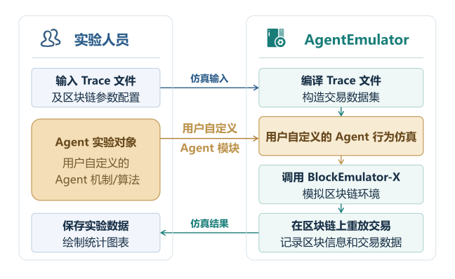
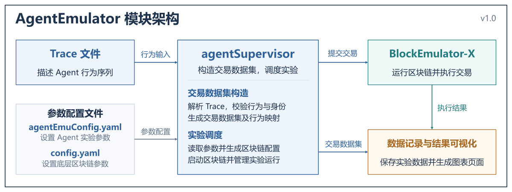

# AgentEmulator (v1.0) 使用说明

# AgentEmulator 简介 / Overview of AgentEmulator

## AgentEmulator 是什么？

AgentEmulator 是由**中山大学·软件工程学院·黄华威研究组（[HuangLab](http://www.xintelligence.pro/)）发起的、面向 AI 智能体可信基础设施的仿真与实验平台**。平台以区块链作为可信记录与结算的基础，旨在帮助研究者和学生围绕智能体的身份、行为审计、支付结算、激励与治理机制开展实验，逐步形成支持 AI 智能体可信交互与协作的研究工具。


AgentEmulator 是面向 AI 智能体行为与区块链相结合场景的、基于 BlockEmulator-X 构建的**实验工具**。其中，BlockEmulator-X 是 HuangLab 于2026年6月开源的区块链仿真实验工具，是初代 BlockEmulator 的升级迭代版本，其 GitHub 代码仓库地址为 github.com/HuangLab-SYSU/block-emulator-x 。


## AgentEmulator 有什么用？

AgentEmulator 实验平台的**设计目标**是简化 AI Agent 相关的实验环境搭建配置、机制验证和数据分析，使实验人员能够轻松地配置底层区块链环境、观察 AI 智能体的行为，并通过实验数据分析在不同机制控制时的运行效果。


下图展示了 AgentEmulator 用户视角的工作流程图。





**图 1.  AgentEmulator 的 general purpose** (并不只是对应于当前 v1.0 版本)。其中，“用户自定义 机制/算法” 具有非常大的自由发挥空间，是用户二次开发、自由创新之地。


## 发展路线 / Roadmap

AgentEmulator 将围绕 AI Agent 的“身份”“结算”“审计”“激励”“治理”五个方向逐步扩展。

以下为拟推进的发展完善路线，具体安排将随相关研究与开发进展进行微调。

|阶段|主要内容|
|---|---|
|**v1.0：基础行为仿真（当前版本）**|支持 Trace 文档驱动的“加入 (Join)”、“支付 (pay)”和“退出 (leave)”行为回放，提供交易执行、行为与交易映射、账户数据记录及结果可视化。|
|**近期：完善身份与审计能力**|逐步实现 DID 注册与注销的智能合约状态管理，扩展权限声明、可验证行为日志和行为追溯能力。|
|**中期：扩展支付与交互机制**|引入微支付、支付通道和批量结算等机制，扩展多轮反馈实验，支持更丰富的 Agent 服务交互场景。|
|**后续：支持激励与协作治理实验**|研究多 Agent 协作中的任务分配、行为协调与责任追溯机制，支持不同协作策略的仿真与效果评估。|
|**长期：建设基准评测平台**|积累标准化 Agent 相关的实验场景、数据集与评测指标，支持不同可信基础设施方案的比较和可复现实验。|


---

## 当前发布版本 v1.0

**当前发布的是 AgentEmulator v1.0，支持基于 Trace（实验输入数据）的基础行为回放、身份注册与注销留痕、逐笔直接支付，以及实验数据记录和可视化。** 实验人员使用 JSONL 格式的 Trace 文件描述 Agent 的**加入**、**转账**和**退出**行为；AgentEmulator 中的 agentSupervisor 模块将 Trace 文件编译为交易数据集，并调用 BlockEmulator-X 启动区块链环境、执行交易、并将交易执行结果上链记录。实验完成后，AgentEmulator 系统会记录交易与 Agent 账户的相关数据，自动绘制余额变化图集，并生成支持中英文切换的 HTML 实验结果页面（由启动脚本在默认浏览器中打开展示）。


AgentEmulator v1.0 中，Agent 行为由 Trace 文件预先定义；身份注册与注销目前仅用于链上留痕，尚未实现完整的 DID 智能合约状态管理。后续版本将持续升级迭代，逐步扩展协议、实验场景和评测能力。


## GitHub 代码仓库地址

GitHub 代码仓库地址为：https://github.com/HuangLab-SYSU/agent-emulator


## 术语解释


本节介绍 AgentEmulator 中的主要术语，帮助实验人员理解系统组成、输入文件和配置文件之间的关系。AgentEmulator 的基本工作流程是：**实验人员通过 Trace 文件描述 Agent 行为；AgentEmulator 中的 agentSupervisor 模块将 Trace 文件编译为交易数据集，并调用 BlockEmulator-X 执行其中的交易；AgentEmulator 随后记录实验数据并展示实验结果。**

|术语|说明|
|---|---|
|AgentEmulator|基于 BlockEmulator-X 构建的 Agent 行为仿真模拟器，将输入的 Agent 行为转换为区块链交易并记录上链，自动记录实验日志并展示实验结果。|
|Agent|实验中执行行为的主体，可按照 Trace 文件中的描述执行“加入”、“支付”和“退出”操作。|
|BlockEmulator-X|AgentEmulator 的底层区块链仿真平台，负责节点运行、共识出块、交易执行和链上数据记录。（GitHub 代码仓库地址为 github.com/HuangLab-SYSU/block-emulator-x）|
|Trace 文件|描述 Agent 行为序列的实验输入文件，采用 JSONL 格式，每行记录一次 Agent 行为或一笔普通转账。|
|agentEmuConfig.yaml 文件|AgentEmulator 的实验配置文件，用于指定 Trace 文件、身份派生种子、结果目录，以及是否启动区块链等参数。|
|config.yaml 文件|BlockEmulator-X 的区块链配置模板，用于设置分片数量、节点数量、出块间隔等底层参数。|
|agentSupervisor|AgentEmulator 的实验调度模块，负责读取配置和 Trace 文件、将行为编译为交易数据集，并组织底层区块链运行及实验数据输出。|
|agent_id|实验人员在 Trace 文件中为 Agent 指定的唯一标识，例如 agent-alice，用于区分不同 Agent 并关联其行为记录。|
|seed|在 agentEmuConfig.yaml 中设置的身份派生种子，系统将其与 agent_id 结合生成 DID。相同的种子与 Agent 标识会生成相同的 DID。|
|DID|去中心化 ID（Decentralized Identifier），用于标识 Agent 的身份，由系统根据 seed 和 agent_id 自动生成，无需在 Trace 文件中手动填写。|


## AgentEmulator 的系统架构

下图展示了 AgentEmulator 的模块架构。




---

# 开始使用 AgentEmulator 做实验

## 环境准备

AgentEmulator 支持在 macOS、Linux 和 Windows 操作系统上运行，环境依赖如下表所示。

|依赖|版本要求|验证命令|用途|
|---|---|---|---|
|Go|≥ 1.25|`go version`|编译运行仿真器|
|Python 3|≥ 3.8|`python3 --version`（Windows：`python --version` 或 `py -3 --version`）|实验后自动绘图|
|matplotlib / numpy / pandas|—|`python3 -c "import matplotlib, numpy, pandas"`|绘图库|

```Bash
# Python 绘图库缺失时安装（Windows 系统直接使用 pip 命令）
pip3 install matplotlib numpy pandas
```

```Bash
git clone https://github.com/HuangLab-SYSU/agent-emulator.git
cd agent-emulator
go build ./...      # 首次编译，验证环境正常
```


---

## 五分钟上手：使用 AgentEmulator 的操作流程

在 Windows 系统中，实验人员可以通过 cmd 执行 `.bat` 批处理脚本，也可以在文件资源管理器中双击运行 `run_agentemu.bat`。具体命令如下：

```Plaintext
run_agentemu.bat
```

```Plain Text
run_agentemu.bat my-config.yaml
```

`run_agentemu.bat` 与 `.sh` 版本所做的行为完全一致：编译 → 清理旧结果 → 运行实验 → 自动绘图 → 在默认浏览器打开 HTML 图册。若 `python` 命令不可用，脚本会自动改用 `py -3`。


实验人员可随时按下 `Ctrl-C` 安全终止实验，随后 BlockEmulator-X 启动的节点子进程会被一并清理。

> **注意**：实验失败时不会执行绘图步骤；另外，每次运行前，脚本文件会先清空 `figs/figs_results/` 里的旧图，绘制的图永远只反映最近一次成功的实验结果。


使用 **MacOS** 和 **Linux** 系统的实验人员使用 bash 运行脚本：

```Bash
bash run_agentemu.sh
```


实验人员运行以上命令后，脚本会依次自动完成以下操作：

1. **编译**：`go build ./...`

2. **清理旧的实验数据**：删除 `./exp` 目录

3. **运行实验**：读取 `agentEmuConfig.yaml` → 编译 trace 为交易数据集 → 自动启动 BlockEmulator-X 区块链（默认 4 分片，每份片 4 节点）→ 交易数据全部上链 → 实验完成，区块链自动停止

4. **自动绘图**：读取最新一轮的数据记录表，生成 PNG 格式的数据图到 `figs/figs_results/`目录中

5. **将 PNG 数据图嵌入 HTML 页面中并自动在浏览器中打开**


实验人员也可使用以下命令自定义配置运行：

```Bash
bash run_agentemu.sh my-config.yaml
```


## 编写 Trace 文件

Trace 文件采用 JSONL 格式记录 Agent 的行为序列，作为 AgentEmulator 的实验输入数据，用于模拟 Agent 行为和区块链常规交易。文件中的每条记录通过 `agent_id` 标识执行行为的 Agent，通过 `ts` 确定行为的执行顺序，并指定具体的行为类型，包括 `join`、`pay` 和 `leave`。AgentEmulator 基于该文件，以确定性方式生成仿真实验的全部后续产物：

```Plain Text
trace 文件（实验的全部意图）
    │  编译：意图 → 真实区块链交易（DID 派生、nonce、数据字段）
    ▼
交易数据集 → 仿真回放 → Agent 账本 / 链上测量 → 绘图展示效果
```


### 注意事项

使用 Trace 文件时，实验人员应注意以下事项：

1. **行为描述与交易生成。** 实验人员通过 Trace 文件描述 Agent 的行为，无需手动构造区块链交易。AgentEmulator 根据行为记录和 `seed`，以确定性方式生成 Agent 身份标识（DID）、交易 nonce 及相关数据字段。

2. **可复现条件与执行顺序。** 在 Trace 文件、`seed` 和代码版本均相同的条件下，AgentEmulator 生成一致的交易计划，具体说明见 Q10。Trace 文件中的 `ts` 用于确定行为的逻辑执行顺序；对于 `ts` 相同的记录，系统按照其在文件中的出现顺序执行。`ts` 不表示交易的实际上链时间，调整其数值间隔也不等同于调整交易的上链时间。

3. **Agent 生命周期与支付约束。** Trace 文件中的 `join`、`leave` 和 `pay` 记录分别描述 Agent 的加入、退出和支付行为。AgentEmulator 按顺序处理这些记录，并更新 `agent_registry.json` 中各 Agent 的 `active` 状态。执行 `pay` 操作时，付款方和收款方均须处于 `active` 状态。

4. **实验数据关联与版本标记。** `request_id` 用于关联支付行为、链上交易和 Agent 账本记录，建议实验人员为其设置全局唯一值，具体分析方法见第 8 章。`params_hash` 用于标记行为参数的版本，系统将该字段原样写入映射文件，以支持多轮实验的数据管理。

5. **普通区块链转账交易。** Trace 文件支持包含 `sender`、`recipient` 和 `value` 字段的普通转账记录。实验人员可以将此类记录与 Agent 行为记录组合使用，从而构造包含不同交易类型的实验负载。


Trace 文件以 JSONL 格式给出，每一行表示一个 agent 执行的某个行为或者是普通转账交易，按 `ts` （TimeStamp）排序（`ts` 相同则按照文件中的行序进行执行）。仓库自带两个示例：`traces/minimal.jsonl`（最小示例）、`traces/agent=100_txs=10000.jsonl`（配置文件中默认使用的 trace 文件，包含100 个 Agent ，1w 笔交易），以下展示一份 trace 文件的示例。

```JSON
{"agent_id":"agent-alice","action":"join","params_hash":"doc-alice-v1","ts":1}
{"agent_id":"agent-bob","action":"join","params_hash":"doc-bob-v1","ts":2}
{"agent_id":"agent-alice","action":"pay","target":"agent-bob","amount":12,"request_id":"payment-1","ts":3}
{"agent_id":"agent-bob","action":"leave","params_hash":"exit-bob","ts":5}
```


### Trace 文件支持的行为类型

|类型|含义|编译成的交易|
|---|---|---|
|`join`|Agent 注册|DID `register` 智能合约调用|
|`pay`|向另一个 agent 转账|普通转账交易|
|`leave`|Agent 注销|DID `revoke` 智能合约调用|
|普通转账交易|非 Agent 的普通转账|普通转账交易|

普通转账交易行中不包含 `action` 字段，靠 trace 文件中的结构（`sender` 键中使用的是账户地址）自动识别，只有三个输入字段， `ts`直接继承 trace 文件中上一行的 `ts`，示例如下：

```JSON
{"sender":"0xabc...","recipient":"0xdef...","value":"12345"}
```


### Trace 文件编写时应该遵守的规则

1. **`pay` 行为的双方 agent（`agent_id` 和 `target`）当时必须处于 active 状态**（已 join 且未 leave），否则整场仿真实验将报错终止。

2. `leave` 操作只能作用于处于 `active` 状态的 agent；已经 `leave` 的 agent 再次 `join` 需要重新注册。

3. `amount` 字段的填写必须为正整数。链上新账户地址会自动获得 10^36 wei 的初始余额，正常实验无需担心账户余额不足。

4. **trace 文件中不需要写 DID**——身份由 `seed + agent_id` 确定性派生，同 seed、同 ID 永远得到同一 DID。

5. `request_id` 建议全局唯一，因为后续需要使用它来检索每个 agent 的"支付意图"数据。


---


## 实验参数配置说明

AgentEmulator 包含两层参数配置：1）Agent 侧的参数配置，由 agentEmuConfig.yaml 配置文档体现；2）底层区块链的参数配置，由 config.yaml 负责对 BlockEmulator-X 中链相关的参数进行配置。


### Agent 侧配置：agentEmuConfig.yaml（当前默认值）

```YAML
base:
  blockemulator_config: ./config.yaml   # BlockEmulator-X 实验模板：分片数/节点数/共识类型等
  result_dir: ./exp/agentemu-results    # 全部 agentSupervisor 产物的根目录
  module_root: "."                      # 仓库根目录（构建区块链二进制用）
experiment:
  seed: 20260903                        # DID 派生种子
  trace: ./traces/agent=100_txs=10000.jsonl   # trace 文件路径
chain:
  enabled: true                         # true：交易数据集产出后自动启动区块链上链
  run_timeout_seconds: 600              # 整场上链实验的超时设置，实验人员可根据交易数量动态调整
  node_exit_grace_seconds: 15           # supervisor 退出后节点的退出窗口期
loop:
  max_rounds: 1                         # 轮次上限（多轮反馈为预留接口，默认单轮）
protocols:
  pay:
    plugin: direct-pay                  # 目前仅支持逐笔直付
  identity:
    plugin: did-simple
    contract_address: "0x0000000000000000000000000000000000000030"
```


### BlockEmulator-X 侧配置：config.yaml（默认使用 BlockEmulator-X 的原生配置）

agentSupervisor 以 `config.yaml` 文件为模板，为每次实验生成独立的 BlockEmulator-X 区块链配置。系统自动调整数据存储路径和日志路径，将交易源设置为 `plan_source`，并将 `tx_number` 设置为 Trace 文件对应的交易数量。实验人员可根据需要修改以下常用配置项：

- `system.shard_num` / `system.node_num`：进行实验的分片数量和每个分片中的节点数量

- `consensus_node.block_interval`：出块间隔（ms）

- `system.log.log_level`：`debug`/ `info` / `warn` / `error` 4种日志等级


---


## 启动运行实验与观察实验结果

实验人员可通过以下命令启动实验，具体详情见 2.2 节。

```Bash
bash run_agentemu.sh            # 或 bash run_agentemu.sh <配置文件>
```

- **BlockEmulator-X 区块链运行过程中的日志会实时镜像到控制台中输出。**同时，完整的实验日志会保存在 `exp/agentemu-results/round_001/chain/logs/`目录中。

- 如果实验人员只想预览编译出的交易数据集、不启动 **BlockEmulator-X** 运行区块链进行实验：在 agentEmuConfig.yaml 配置文件中把 `chain.enabled` 改为 `false`即可（此时不会启动 BlockEmulator-X 运行区块链进行实验，只会产生 agentSupervisor 将 trace 文件编译完成后生成的交易数据集）

- 实验结束时会在控制台打印各结果的输出路径与绘图路径（`figs/figs_results/index.html`）


---


## 实验结束后输出的文件一览

### 实验结束后生成的结果文件

```Plaintext
exp/agentemu-results/
├── agent_registry.json            # agent_id ↔ DID 映射与 active 状态
├── rounds_summary.json            # 每轮记录数/交易数汇总
└── round_001/
    ├── agent_transactions.jsonl   # 交易数据集（hash/双方/金额/nonce/data）
    ├── agent_action_txs.jsonl     # ★ 动作→交易映射（意图 ↔ 链上 hash）
    ├── Agent_Events.csv           # Agent 行为事件流
    ├── agents/                    # ★ 每 Agent 账本（绘图的输入）
    │   ├── agent-001.csv
    │   └── ...                    # 每个 active Agent 对应一个文件
    └── chain/                     # 本次实验区块链运行相关结果
        ├── config.yaml / ip_table.json
        ├── logs/                  # BlockEmulator-X 启动的各节点运行时产生的日志
        └── results/
            ├── relay_stats_detail_tx_info.csv   # ★ 链上每笔交易的生命周期
            └── relay_stats_brief_info.csv       # 按 epoch 的 TPS/TCL 汇总
```


### 数据记录表 CSV（`agents/agent-XXX.csv`）格式说明

该数据记录表 csv 文件中的每一行代表一条 Agent 操作的记录，数据格式如下：

```Plaintext
block_height, tx_hash, sender, recipient, value, balance, block_time_ms
```

- `balance` 为该交易执行后对应 Agent 的余额，数值约 10^36、**超出 int64 数据类型可表示的范围，需按字符串读入**

- `block_time_ms` 为打包该交易的区块出块时间

- 数据记录表中的行序按照区块出块时间排序，同一时间内以分片/高度/块内的序号决定最后的顺序


**`agent_action_txs.jsonl`**（每个 Agent 动作用一行来表示）文件的示例如下：

```JSON
{"seq":3,"action":"pay","agent_id":"agent-alice","target":"agent-bob","amount":12,
 "ts":3,"request_id":"payment-1","params_hash":"","tx_hashes":["f58c994e..."]}
```


---


## 实验结果的展示

每次实验成功完成后，AgentEmulator 自动读取本轮实验的 Agent 账本 CSV 文件，生成采用论文排版风格的余额变化图，并以 PNG 格式保存至 `figs/figs_results/` 目录。随后，系统将图表整合为支持中英文切换的静态 HTML 图册页面（`figs/figs_results/index.html`），并在默认浏览器中自动打开该页面。

以下各小节依次介绍自动绘图流程（7.1）、四张图表的展示内容（7.2）、图册页面的使用方法（7.3），以及无需重新运行实验的手动绘图方法（7.4）。


### 实验结束后，模拟器自动执行如下操作

`run_agentemu.sh`（Windows 下为 `run_agentemu.bat`）脚本文件在实验成功结束后将自动执行以下操作：

1. 定位 `exp/agentemu-results/` 下 round 编号最大一轮的 `agents/` 目录

2. 清空 `figs/figs_results/` 里的旧图与旧 `index.html`文件

3. 运行 `figs/python_code/plot_agent_balance.py` 生成全部实验图的 PNG 格式图片

4. 运行 `figs/python_code/build_fig_html.py` 生成展示图表的 html 页面

5. 调用系统的 `open`（macOS）/ `xdg-open`（Linux）/ `start`（Windows）命令，在实验人员电脑中的默认浏览器打开 `figs/figs_results/index.html` 页面，展示绘图结果


### 实验图绘制的内容

|页面编号|内容|对应的 PNG 文件|
|---|---|---|
|图 1|全部 Agent 余额变化总览：左图"按 Agent ID"，右图"按 Δbalance 升序"展示所有 agent 余额变化的柱状图|`fig1_all_agents_overview.png`|
|图 2|按照交易顺序统计全体 Agent 的余额分布。主要过程如下：先按照 tx_hash 去重后按确定性顺序回放 每个 agent 的余额变化，然后展示最小\最大位置线、四分位线与均值线|`fig2_global_tx_order.png`|
|图 3|按不同 agent 的交易进度归一化对齐：各 agent 自身交易序号拉伸到 0–1 后叠加，附终点均值标注|`fig3_normalized_progress.png`|
|图 4|分组展示各个 agent 的余额变化：每 5 个 Agent 一张子图，含该 Agent 自己的区块分界虚线|`fig4_agents_001-005.png` … `fig4_agents_096-100.png`|

请注意，所有图绘制的是**相对初始余额的变化量 Δbalance = balance − 初始余额**。


以下展示的实验结果是在一台 Mac mini（macOS 15.6）上运行的，硬件为 Apple M4 Pro 芯片（12 核：8 个性能核 + 4 个能效核）、24 GB 统一内存。区块链环境基于课题组自研的 BlockEmulator-X（Go 语言版本为 1.25.7，GitHub 代码仓库地址为 `github.com/HuangLab-SYSU/block-emulator-x`）。本次实验采用单机多进程模拟部署：共 4 个分片、每分片 4 个共识节点（合计 16 个共识节点）外加 1 个 supervisor 节点，均以 127.0.0.1 IP 下的不同端口（32217–32547，BlockEmulator-X 中的 supervisor 节点端口号为 38800）通过 direct 模式通信；共识与跨分片协议为 static_relay（账户分布静态、跨片交易由 Relay 处理），出块间隔设置为 2000 ms，交易池按交易数量打包、每块上限 5000 笔，区块存储采用 BoltDB、世界状态采用以太坊式 LevelDB，布隆过滤器位图长度 4096；在此之上的 AgentEmulator 实验层以随机种子 20260903 回放包含 100 个 agent、10,000 笔交易的 trace（`plan_source` 方式），每轮实验自动编译并运行全新的 BlockEmulator-X 区块链模拟实验。


### 用于展示实验的 HTML 页面的 UI 设计

- 顶部深色页眉：标题、生成时间、图表数量、数据来源目录与 Agent 数

- 图 1/2/3 整幅展示，图 4 为缩略图网格；**点击任意图片可在新标签页打开原图**

- **中英文切换**：右上角按钮（当前中文时显示 "EN"，英文时显示"中文"），或按键盘 `L` 键；切换作用于页面标题、章节标题、元信息与页脚，语言偏好自动记忆，下次打开该 html 页面时保持上一次的设置

- 图内文字由绘图脚本生成，不随页面语言切换变化


### 手动 / 独立运行绘图脚本

实验人员不重跑整个实验也可以随时重新画图。绘图脚本路径按 `figs/python_code/` 相对路径进行定位，在仓库任意目录下运行均可：

```Bash
# 默认：自动选取最新一轮实验结果，输出到 figs/figs_results/
python3 figs/python_code/plot_agent_balance.py
python3 figs/python_code/build_fig_html.py

# 指定数据目录与输出目录（例如用历史快照重新绘制）
python3 figs/python_code/plot_agent_balance.py \
    --data-dir exp/agentemu-results/round_001/agents \
    --fig-dir figs/figs_results
python3 figs/python_code/build_fig_html.py \
    --data-dir exp/agentemu-results/round_001/agents

# 只生成页面不重新画图
python3 figs/python_code/build_fig_html.py

# 打开图册
open figs/figs_results/index.html        # macOS
```

Windows 下等价命令（实验人员可通过 cmd 运行，路径使用反斜杠；`python` 不可用时改用 `py -3`）：

```Plaintext
python figs\python_code\plot_agent_balance.py
python figs\python_code\build_fig_html.py

python figs\python_code\plot_agent_balance.py --data-dir exp\agentemu-results\round_001\agents --fig-dir figs\figs_results
python figs\python_code\build_fig_html.py --data-dir exp\agentemu-results\round_001\agents

rem 打开图册
start "" figs\figs_results\index.html
```

两个绘图脚本的参数说明如下表：

|脚本|参数|默认值|说明|
|---|---|---|---|
|`plot_agent_balance.py`|`--data-dir`|自动选最新一轮 `agents/`|agent CSV 所在目录|
||`--fig-dir`|`figs/figs_results/`|绘图结果的 PNG 图片输出目录|
|`build_fig_html.py`|`--fig-dir`|`figs/figs_results/`|扫描 PNG 并在此生成 `index.html`页面|
||`--data-dir`|无|仅用于页面显示数据来源与 Agent 数量|


---


## 对实验结果进行分析

实验人员可通过实验产生的部分结果进行联合解析，即可回答“某笔支付是否确认、何时确认”的问题。解析路径为：`agent_action_txs.jsonl`（request_id → tx hashes）→ `relay_stats_detail_tx_info.csv`（hash → 提交时间）。具体的代码如下：

```Python
import json, csv

chain = {}
with open('exp/agentemu-results/round_001/chain/results/relay_stats_detail_tx_info.csv') as f:
    for row in csv.DictReader(f):
        chain[row['OriginalHash']] = row

total = confirmed = 0
for line in open('exp/agentemu-results/round_001/agent_action_txs.jsonl'):
    a = json.loads(line)
    if a['action'] != 'pay':
        continue
    total += 1
    if all(h in chain for h in a['tx_hashes']):
        confirmed += 1
        # 例：查某笔的确认时间
        # print(a['request_id'], chain[a['tx_hashes'][0]]['Tx finally commit time'])

print(f'支付意图 {confirmed}/{total} 全部确认')
```

延迟的统计口径为：`Tx finally commit time − Tx create time`；跨片交易在 CSV 表格中有 Relay1/Relay2 两段提议/提交时间进行细分。

实验人员也可以直接使用 pandas 库进行 Agent 账本分析，相关代码如下：

```Python
import pandas as pd
df = pd.read_csv('exp/agentemu-results/round_001/agents/agent-001.csv',
                 dtype={'balance': str, 'value': str})
```


---

# 常见问题（FAQ）

**Q1：重跑报 `file already exists: .../block_record.csv`？**
上一次的产物没清理，而测量文件是独占创建的。`run_agentemu.sh` 已自动清理；手动运行 `go run cmd/agentemu/main.go` 前需实验人员先执行 `rm -rf exp/agentemu-results`。


**Q2：为什么有时 join 操作没有生成注册交易？**
`agent_registry.json` 里该 Agent 已是 active。join 只在身份**首次出现或离场后重入**时生成注册交易。完整清理旧结果即可复现全量注册。


**Q3：转账是智能合约调用吗？**
不是。`pay` 编译为**普通转账**；`join`/`leave` 是智能合约调用形式。这些智能合约当前未部署，调用在 EVM 层只是做了一个记录，而非真实智能合约状态；不过 `pay` 的余额转移是真实生效的。


**Q4：控制台日志输出太多？**
`config.yaml` 里 `system.log.log_level: warn`，或运行时重定向 `bash run_agentemu.sh > run.log 2>&1`。


**Q5：想跑单分片小规模实验？**
`config.yaml` 的 `system.shard_num` 改为 `1`，也可以按需设计 `Trace`文件调整交易输入规模。


**Q6：实验跑完但没有弹出 HTML 页面？**
先看控制台末尾是否有 `figures & gallery: ./figs/figs_results/index.html`：

- 没有这行且出现 `warn: no agent CSVs ...`：本轮没有生成 Agent 数据记录（例如 `chain.enabled: false` 的预览运行），属正常

- 有这行但 HTML 页面没出现：手动 `open figs/figs_results/index.html` 即可；无图形界面的服务器上请把目录拷回本地查看


**Q7：绘图脚本报 `ModuleNotFoundError: matplotlib`？**
`pip3 install matplotlib numpy pandas`，或换用已装好这些库的解释器。


**Q8：想用上一轮的历史数据重新画图？**
见 7.4 节，`--data-dir` 指向对应的 `round_XXX/agents/` 即可；注意 `run_agentemu.sh` 每次运行会清空 `exp/` 与 `figs/figs_results/`，历史数据需提前备份。


**Q9：图 4 的 20 张子图太多，能只看某几个 Agent 吗？**
当前按每 5 个 Agent 固定分组，分组逻辑在 `figs/python_code/plot_agent_balance.py` 的图 4 段（`range(0, len(dfs), 5)`），可自行修改分组大小后手动重跑（7.4 节）。


**Q10：实验结果可以复现吗？**
可以。同 seed + 同 trace + 同代码，计划文件、映射、事件 CSV 逐字节一致；Agent 数据记录按确定性全局顺序生成。链上侧的打包时序受运行时影响（与 BlockEmulator-X 本身一致），因此图 2 的中间包络形态每次可能略有不同，但期末值与守恒关系不变。


**Q11（Windows）：提示“python 不是内部或外部命令”，或运行 python 却弹出了 Microsoft Store？**
说明 Python 未真正安装或未加入 PATH：从 [python.org](https://www.python.org/downloads/windows/) 安装时勾选 "Add python.exe to PATH"；或直接改用 Windows 自带的启动器 `py -3`（`run_agentemu.bat` 已自动回退到它）。安装完成后执行 `pip install matplotlib numpy pandas`。


---

# 附录

## 未来可完善的一些问题

- **智能合约为留痕模式**：DID 智能合约未部署，`join`/`leave` 调用是数据上链占位（智能合约部署在路线图上）；`pay` 的余额转移是真实生效的。

- **单轮运行**：多轮反馈循环（AgentAPI/EndCondition 接口）已预留，但默认单轮，因此自动绘图固定取最新（即唯一）一轮。

- **错误即终止**：trace 中出现非法动作（如给未 join 的 Agent 转账）会终止整场仿真，错误信息带行号。

- 绘图依赖实验数据形状：BlockEmulator-X 为链上每个 Agent 的账户地址设置相同初始余额；当 trace 中混入大量原始转账行时，图 2 的确定性回放顺序仅作示意（数据无区块内时间戳）。


## 对实验室结果展示的 HTML页面样例

[AgentEmulator Experiment · Agent Balance Lifecycle Figures.pdf](docs/figures/pdfs/AgentEmulator%20Experiment%20·%20Agent%20Balance%20Lifecycle%20Figures.pdf)


